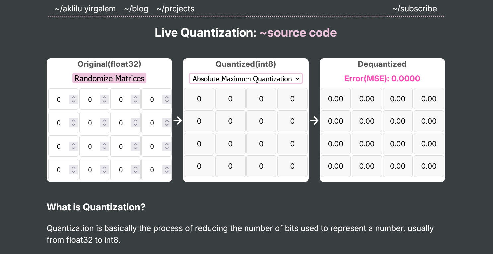
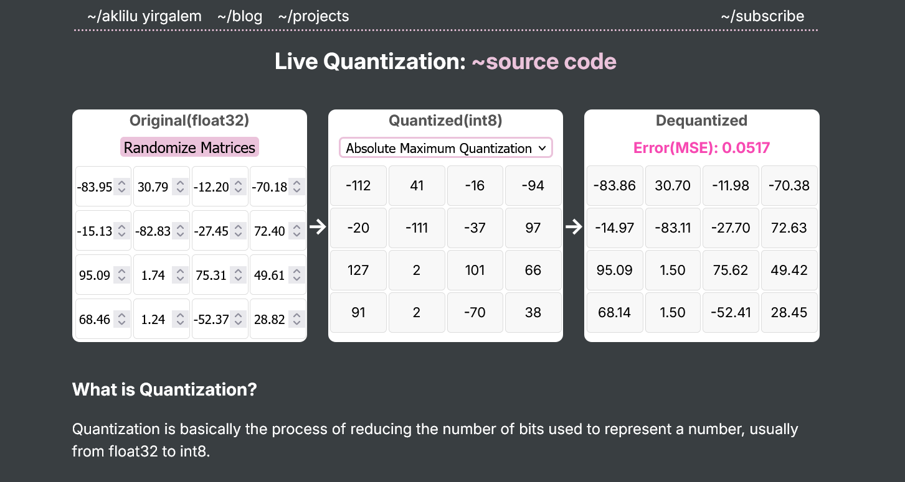

# 🧠 Live Model Quantization in the Browser

A minimal, open-source demo that shows live model quantization running directly in the browser.

👉 **Try it here:** [https://your-demo-url.com]([[https://your-demo-url.com](https://akliluyirgalem.github.io/project/live-quantization/)](https://akliluyirgalem.github.io/project/live-quantization/))

---

## 📸 Preview

---

